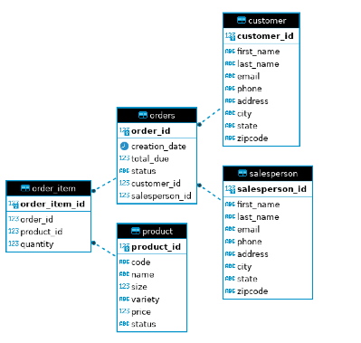

# Introduction 

This project aimed to gain proficiency in data access patterns and JDBC by performing data manipulation tasks on the hplussport PostgreSQL database. The tools utilized for the project included Dbeaver and Intellij Idea for database management, Docker for containerization, PostgreSQL and PSQL CLI tool for database creation and manipulation, JDBC for data access, and Maven for build automation. The project's scope focused on creating database connections and performing data manipulation tasks, such as inserts, updates, and queries, using JDBC and data access-designed patterns.

# Implementation
## ER Diagram

## Design Patterns

 The DAO design pattern is commonly used to create an interface between raw JDBC 
code and business logic, ensuring clear separation of concerns. DAOs can be a simple abstraction 
layer or a full-fledged object, and they can handle complex joins and aggregations. DTOs are often 
paired with DAOs, providing encapsulated objects that can contain sub-objects.

In contrast, the repository pattern focuses on single-table access per class and 
performs joins in the code rather than the database. This pattern is useful in 
distributed systems because it facilitates sharding the database for single-table access. Deciding 
between DAO and repository patterns depends on several factors, such as application scalability, 
join complexity, and the need for atomic transactions.

# Test

First, the database was set up properly by creating tables, indexes, and constraints. 
Next, a test data set was created to populate the database with sample data that was used to run 
test queries. Then, queries were executed against the database to ensure that the app was properly 
interacting with the database and that the expected results were returned. This involved verifying 
that data was being inserted, updated, and deleted as expect and that the app was able to retrieve 
the correct information from the database.

