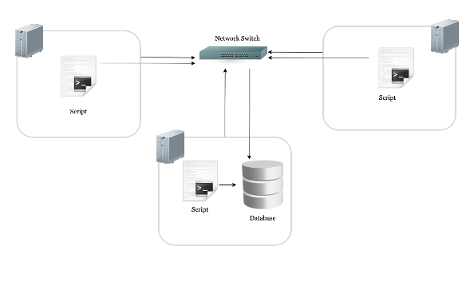

# Introduction
The Linux Project is a cluster monitoring agent designed to collect both hardware and resource usage data from every machine in a cluster, and store this information in a PostgreSQL database. This data collection and insertion into the database are carried out by two Bash scripts, which are installed on each node of the cluster. Later on, the Jarvis cluster administration team will be able to leverage this data to answer critical business questions.

Apart from Bash scripts, several other technologies are used in this project, including Linux command-line to create commands that extract specific machine information, such as the number of CPUs, PostgreSQL for data persistence, Docker for managing the PostgreSQL instance, IntelliJ IDEA as the primary integrated development environment, and crontab for automating the application.

# Quick Start
To get started with the Linux project, follow these steps:

  1. Launch a psql instance by running psql_docker.sh: <br/> ``` ./scripts/psql_docker.sh start ```
  2. Create the necessary tables by executing ddl.sql on the PostgreSQL database: <br/> ``` psql -h HOST_NAME -p 5432 -U USER_NAME -d DB_NAME -c ddl.sql ```
  3. Insert hardware specification data into the database using host_info.sh: <br/> ``` ./scripts/host_info.sh psql_host psql_port db_name psql_user psql_password```
  4. Insert hardware usage data into the database using host_usage.sh: <br/> ``` ./scripts/host_info.sh psql_host psql_port db_name psql_user psql_password ```
  5. Set up a crontab entry to collect data every minute: <br/> ``` * * * * * bash /path to host_usage.sh localhost 5432 db_name db_user db_password > /tmp/host_usage.log ```


# Implementation

  - Set up a PostgreSQL (PSQL) instance using Docker.
  - Design two tables to store hardware specifications and resource usage data in the PostgreSQL instance.
  - Implement the monitoring agent by collecting hardware information and resource usage data using Bash commands and persisting it to the database using SQL queries.
  - Automate the application using crontab.

## Architecture

## Scripts
The project includes several Bash scripts for collecting and inserting data into the PostgreSQL database, as well as a DDL script and a crontab setup.
- **ddl.sql** </br>
This script contains the SQL statements for creating the host_info and host_usage tables in the PostgreSQL database. The script can be executed using the psql command-line tool, as shown in the Quick Start section.
- **psql_docker.sh** </br>
This script starts or stops a Docker container running PostgreSQL. </br>
**The usage of the script is:** </br>  ``` ./scripts/psql_docker.sh start|stop [container_name] [port] ```
  - start: Starts the Docker container with the specified name (default name is "psql_container") and port (default port is "5432").
  - stop: Stops the running Docker container with the specified name.
- **host_info.sh** </br>
This script collects hardware information from the host machine and inserts it into the PostgreSQL database. </br> 
**The usage of the script is:** </br> ```./scripts/host_info.sh psql_host psql_port db_name psql_user psql_password```
  - psql_host: The hostname where the PostgreSQL server is running.
  - psql_port: The port number that the PostgreSQL server is listening on.
  - db_name: The name of the PostgreSQL database to connect to.
  - psql_user: The username to use when connecting to the PostgreSQL server.
  - psql_password: The password to use when connecting to the PostgreSQL server.
- **host_usage.sh** </br>
This script collects resource usage data from the host machine and inserts it into the PostgreSQL database.</br>
**The usage of the script is:** </br>
```./scripts/host_usage.sh psql_host psql_port db_name psql_user psql_password```</br>
***Arguments are as shown in the host_info.sh usage section***
## Database Modelling
**host_info table**
| Column Name  | Data Type | Constraints | Description                            |
|--------------|-----------|-------------|----------------------------------------|
| id           | SERIAL    | NOT NULL    | Unique ID for each host                |
| hostname     | VARCHAR   | NOT NULL    | Hostname of the machine                |
| cpu_number   | INT2       | NOT NULL    | Number of CPUs in the machine           |
| cpu_architecture | VARCHAR   | NOT NULL    | Architecture of the CPU in the machine |
| cpu_model    | VARCHAR   | NOT NULL    | Model name of the CPU in the machine    |
| cpu_mhz      | FLOAT8     | NOT NULL    | Clock speed of the CPU in MHz           |
| L2_cache     | INT4       | NOT NULL    | Size of the L2 cache in bytes           |
| total_mem    | INT4       | NOT NULL    | Total memory in the machine (MB)        |
| timestamp    | TIMESTAMP| NOT NULL    | Time when the record was inserted       |


**host_usage table**
| Column Name | Data Type | Description | Constraints |
|-------------|----------|-------------|----------|
| timestamp   | TIMESTAMP| The timestamp when the data is collected | NOT NULL |
| host_id     | SERIAL      |Unique ID for each host machine (foreign key) | NOT NULL |
| memory_free | INT4  | The amount of free memory in MB | NOT NULL |
| cpu_idle    | INT2 | The percentage of idle CPU | NOT NULL |
| cpu_kernel  | INT2 | The percentage of kernel CPU usage | NOT NULL |
| disk_io     | INT4  | The number of disk I/O operations per second | NOT NULL |
| disk_available | integer  | The amount of available disk space in MB |NOT NULL |

## Tests
To test the bash script DDL:
1. Run the script to ensure it executes without any errors.
2. Connect to the PostgreSQL database and verify that the tables were created with the expected columns.
3. Attempt to insert data into the tables and verify that the data is stored as expected.
## Deployment
To deploy the application, I utilized crontab to automate the data collection process using the command: </br>
``` * * * * * bash /path to host_usage.sh localhost 5432 db_name db_user db_password > /tmp/host_usage.log ``` </br>
This command was scheduled to run every minute, which allowed the monitoring agent to collect and persist hardware usage data at regular intervals. The data was then stored in a PostgreSQL database, which was managed using Docker.
